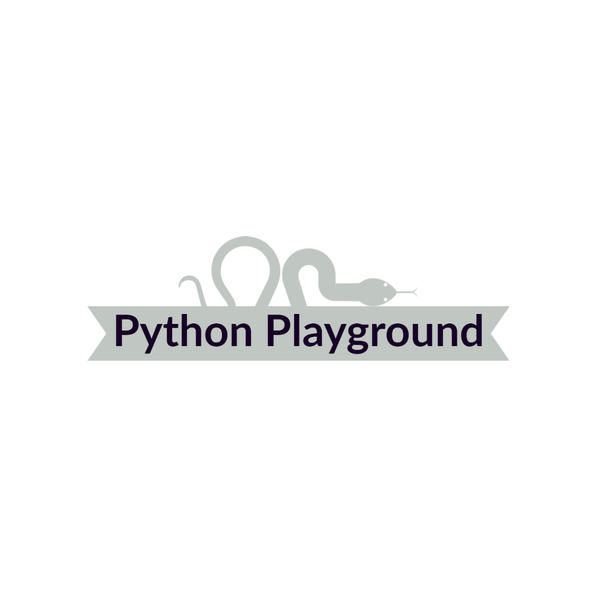
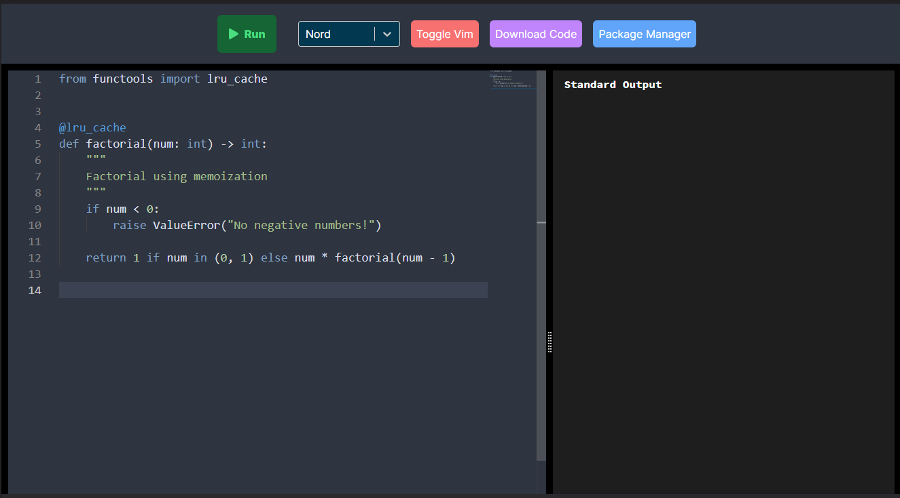
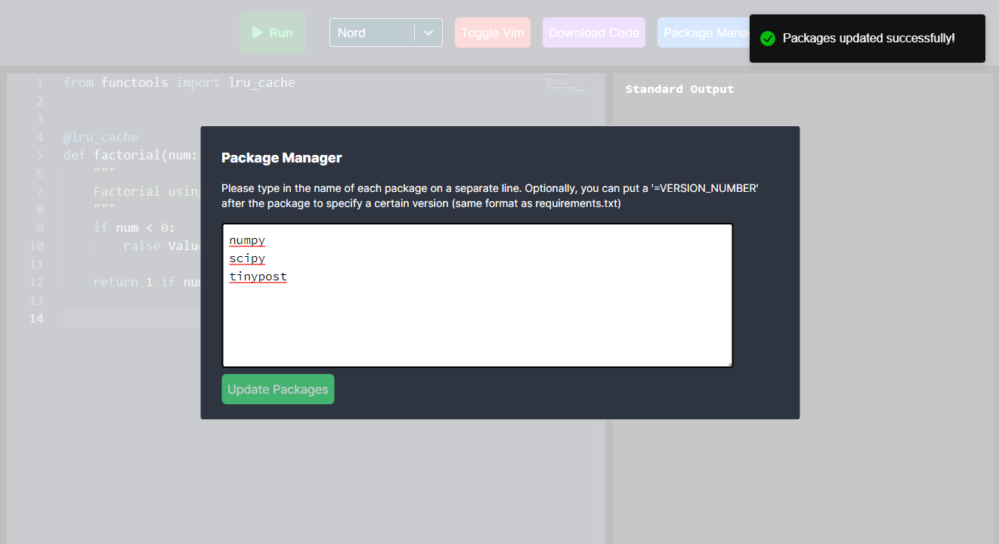

<div id="top"></div>

<!-- PROJECT SHIELDS -->
<!--
*** I'm using markdown "reference style" links for readability.
*** Reference links are enclosed in brackets [ ] instead of parentheses ( ).
*** See the bottom of this document for the declaration of the reference variables
*** for contributors-url, forks-url, etc. This is an optional, concise syntax you may use.
*** https://www.markdownguide.org/basic-syntax/#reference-style-links
-->

<!-- PROJECT LOGO -->
<br />
<div align="center">
  <a href="#">
    
  </a>

  <h1 align="center">Python Playground</h3>

  <p align="center">
    Run python code securely and quickly in the browser!
  </p>
</div>

<!-- TABLE OF CONTENTS -->
<details>
  <summary>Table of Contents</summary>
  <ol>
    <li>
      <a href="#about-the-project">About The Project</a>
      <ul>
        <li><a href="#built-with">Built With</a></li>
      </ul>
    </li>
    <li>
      <a href="#getting-started">Getting Started</a>
      <ul>
        <li><a href="#prerequisites">Prerequisites</a></li>
        <li><a href="#installation">Installation</a></li>
      </ul>
    </li>
  </ol>
</details>


<!-- ABOUT THE PROJECT -->
## About The Project



Python is one of the most notorius languages in the industry. Known for its
flexibility and english-like syntax, Python serves as a great language
for beginners. As beginners may not have adequate development environments,
Python Playground acts as a simple tool to get started with python.

<p align="right">(<a href="#top">back to top</a>)</p>

### Features

 - Excellent code editing experience
   - Powered by Monaco, the editor that powers VS Code
 - Rich python intellisense and syntax highlighting
   - Powered WebSockets and a Python Language Server Protocol (LSP) implementation
 - Containerized python runtime environments to bolster server security
   - Powered by Docker
 - Resizeable editor and output panes
 - Built-in package manager to use the most cutting-edge `pip` packages
 - Download code from brower directly into `.py` files
 - Modern UI with a variety of light and dark themes



### Built With

Python Playground uses modern frameworks and technologies to provide an ideal
user experience with adequate security.

* [React.js](https://reactjs.org/)
* [Tailwind CSS](https://tailwindcss.com/)
* [Node.js](https://nodejs.org/)
* [Express.js](https://expressjs.com/)
* [Docker](https://docker.com)
* [Monaco Editor](https://microsoft.github.io/monaco-editor/)
* [Python LSP](https://github.com/python-lsp/python-lsp-server)

<p align="right">(<a href="#top">back to top</a>)</p>


<!-- GETTING STARTED -->
## Getting Started

### Prerequisites

* `Node.js` (with `npm`) version 16+
* `Docker` version 18+
* `Python` (with `pip`)

### Installation

1. Clone the repo
   ```sh
   git clone https://github.com/UPDATE_LINK
   ```
2. Install client `npm` packages
   ```sh
   cd client # from the root of the project
   npm install
   ```
3. Install server `npm` packages
   ```sh
   cd server # from the root of the project
   npm install 
   ```
4. Install python LSP
    ```sh
    pip install python-lsp-server
    pip install python-lsp-server[yapf]
    ```
5. Find path of python LSP
    ```sh
    which pyslp # save this output
    ```
6. Create a `.env` file in `server` put the path there as `PYTHON_LSP_SERVER_PATH`
7. Start client (`cd` into `client`)
    ```sh
    npm run dev
    ```
8. Start server (`cd` into `server`)
    ```sh
    npm start
    ```

If the ports used by Python Playground are already in use, you can change
the frontend port in `client/vite.config.ts` and/or change the backend port
in `server/core/index.js`

<p align="right">(<a href="#top">back to top</a>)</p>